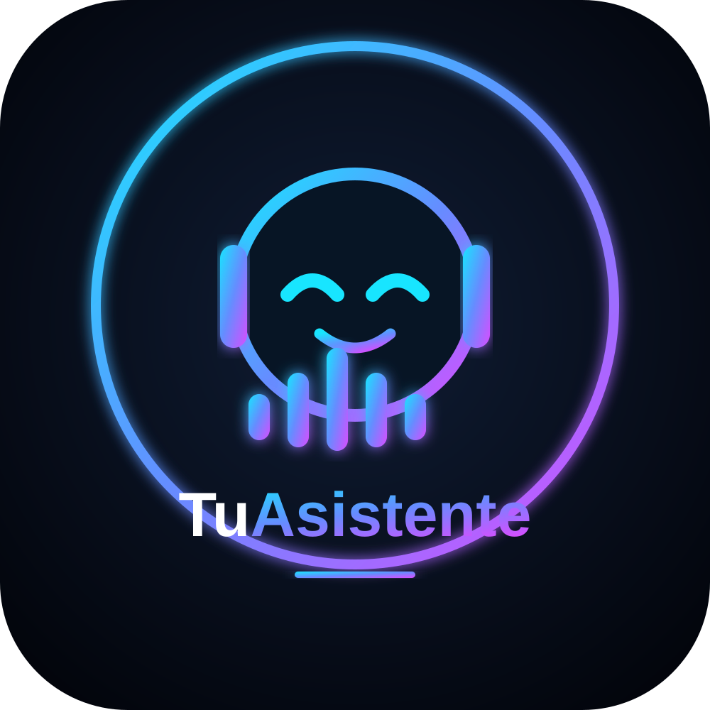
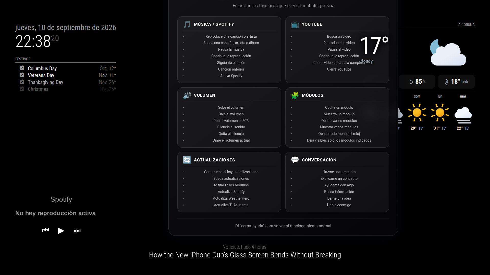

<p align="center">
  
</p>

# MMM-TuAsistente

## 🚀 INSTALACIÓN

```bash
cd ~/MagicMirror/modules
git clone https://github.com/orlandoida06-rgb/MMM-TuAsistente.git
cd MMM-TuAsistente
chmod +x install.sh
./install.sh
```

El instalador es modular. Permite seleccionar exactamente los componentes que quieres instalar.

### Componentes

- MMM-TuAsistente
- MMM-TuAsistente-Spotify
- LibreSpot
- Ollama
- Piper TTS
- Wake Word / PTT
- Audio
- Configuración automática de MagicMirror

### Spotify independiente

Selecciona `MMM-TuAsistente-Spotify`. LibreSpot se selecciona automáticamente como dependencia.

```text
✓ MMM-TuAsistente-Spotify
✓ LibreSpot
```

No se instalan automáticamente TuAsistente, Ollama, Piper, Wake Word/PTT ni Audio.

### Asistente completo

Selecciona `MMM-TuAsistente`, `Ollama`, `Piper TTS`, `Wake Word / PTT` y `Audio`. Las dependencias se resuelven automáticamente.

### Configuración automática

Puedes seleccionar la configuración automática de MagicMirror. Se realiza copia de seguridad de `config.js` y comprobación de sintaxis.

### Reiniciar


pm2 restart mm
```

---

# MMM-TuAsistente

**MMM-TuAsistente** es un módulo inteligente y local para **MagicMirror²** impulsado por modelos LLM locales (**Ollama / Qwen**), síntesis de voz offline (**Piper TTS**) y detección de voz/PTT (**OpenWakeWord** / Tecla física). Diseñado y optimizado para funcionar de manera fluida en placas SBC como **Orange Pi 5** y **Raspberry Pi**.

---

## 🧩 Características

* 🤖 **LLM 100% Local:** Integración directa con Ollama (por defecto `qwen2.5:1.5b` o `gemma3:4b`).
* 🔊 **Síntesis de Voz Offline:** Voz natural y rápida usando **Piper TTS** (`es_ES-davefx-medium`).
* 🎙️ **Doble Modo de Activación:**
  * **Wake Word (Voz):** Escucha continua usando **OpenWakeWord** (*"Hey Mycroft"*).
  * **PTT (Push-To-Talk):** Activación por teclado o botón físico mediante script dedicado.
* ▶️ **Control de YouTube:** Reproduce y cierra vídeos mediante comandos de voz directos (vía `yt-dlp`).
* ⚡ **Optimizado para ARM64:** Uso eficiente de recursos sin depender de APIs en la nube.

---

## 👤 Sobre el proyecto

**MMM-TuAsistente** ha sido desarrollado originalmente para **uso personal**, como un asistente de voz local integrado

El proyecto se ha desarrollado y probado en una **Orange Pi 5 Plus**, utilizando sus recursos locales para el procesamiento de voz, síntesis de voz, inteligencia artificial y reproducción multimedia.

El objetivo principal es crear un asistente integrado en MagicMirror capaz de controlar diferentes funciones de la pantalla mediante comandos de voz, manteniendo el procesamiento local siempre que sea posible.

---


## 🔄 Actualización de módulos por voz

MMM-TuAsistente incorpora un sistema de actualización de módulos de MagicMirror mediante comandos de voz.

### Comprobar actualizaciones

Puedes preguntar:

- **"Hay actualizaciones"**
- **"Busca actualizaciones"**
- **"Comprueba las actualizaciones"**

El asistente comprueba los repositorios Git de los módulos instalados y responde mediante voz si existen actualizaciones disponibles.

Esta opción **solo comprueba**. No modifica ningún archivo ni reinicia MagicMirror.

### Actualizar módulos

Para actualizar todos los módulos compatibles:

- **"Actualiza los módulos"**
- **"Actualizar los módulos"**

También puedes actualizar un módulo concreto:

- **"Actualiza TuAsistente"**
- **"Actualiza Spotify"**
- **"Actualiza WeatherHero"**

El sistema identifica automáticamente el repositorio correspondiente.

### Protección de cambios locales

Antes de actualizar un módulo se comprueba si contiene cambios locales.

Si existen cambios locales, el módulo se omite para evitar sobrescribir modificaciones del usuario.

En particular, archivos de configuración modificados localmente, como `config.js`, no se sobrescriben mediante este sistema.

Los repositorios independientes instalados dentro de otros módulos tampoco bloquean las actualizaciones del módulo principal.

### Actualización segura

Las actualizaciones se realizan mediante Git utilizando `pull --ff-only`, evitando fusiones automáticas que puedan provocar conflictos.

MagicMirror solo se reinicia cuando se ha realizado correctamente al menos una actualización.


# 🖼️ Capturas del módulo

## 🏠 Interfaz principal

<p align="center">

</p>

## 🎙️ Escuchando

<p align="center">

</p>

## 🧠 Pensando

<p align="center">

</p>

## 🔊 Volumen

<p align="center">

</p>

## ▶️ YouTube

<p align="center">

</p>

## 🎛️ Control de módulos por voz

MMM-TuAsistente permite controlar la visibilidad de otros módulos de MagicMirror mediante comandos de voz.

El asistente permanece visible mientras controla el resto de módulos.

### Comandos disponibles

#### Ocultar y mostrar todos los módulos

- **"Oculta todo"**
- **"Muestra todo"**

#### Control del tiempo

- **"Oculta el tiempo"**
- **"Muestra el tiempo"**
- También se reconocen referencias como "clima" o "weather".

#### Control de Spotify

- **"Oculta Spotify"**
- **"Muestra Spotify"**
- También se reconocen comandos relacionados con "música".

#### Control de noticias

- **"Oculta las noticias"**
- **"Muestra las noticias"**
- También se reconoce "noticia".

### Funcionamiento

El control de visibilidad está integrado directamente en `MMM-TuAsistente`, sin necesidad de instalar un módulo adicional.

Cuando se reconoce un comando:

1. El asistente identifica la acción (`ocultar` o `mostrar`).
2. Identifica el grupo de módulos afectado.
3. Envía la orden al frontend de MagicMirror.
4. Los módulos realizan una transición animada.
5. El asistente confirma la acción mediante voz.

Los grupos actualmente disponibles son:

- `all` — todos los módulos controlables.
- `weather` — módulos meteorológicos.
- `spotify` — MMM-TuAsistente-Spotify.
- `news` — módulo de noticias.

`MMM-TuAsistente` no se oculta mediante el comando "Oculta todo", por lo que siempre permanece disponible para recibir nuevos comandos de voz.

## ⭐ Ocultar todo menos determinados módulos

MMM-TuAsistente permite ocultar todos los módulos excepto los indicados mediante una única orden de voz.

Ejemplos:

- **"Oculta todo menos el reloj"**
- **"Oculta todo menos el reloj y Spotify"**
- **"Oculta todo menos Spotify y el tiempo"**
- **"Oculta todo menos el reloj, Spotify y las noticias"**
- **"Deja visible solo el reloj y Spotify"**

El sistema puede controlar varios módulos en una misma orden y utiliza los módulos que están realmente cargados en MagicMirror.

No es necesario instalar `MMM-ModuleHider` ni otro módulo adicional.

`MMM-TuAsistente` permanece protegido y no se oculta mediante las órdenes globales.

### Perfiles de pantalla

La arquitectura de control de visibilidad permite ampliar el sistema posteriormente con perfiles completos de pantalla, por ejemplo:

- **Modo limpio** — interfaz mínima.
- **Modo información** — reloj, tiempo, calendario y noticias.
- **Modo música** — interfaz centrada en Spotify.
- **Modo noche** — pantalla prácticamente limpia.

Estos perfiles podrán activarse también mediante comandos de voz.


## 🆘 Modo Ayuda por voz

MMM-TuAsistente incorpora un modo de ayuda visual activado directamente mediante voz.

Puedes decir:

- **"Ayuda"**
- **"Ayudas"**

La orden de ayuda se procesa directamente, sin necesidad de consultar al modelo Ollama.

### Pantalla de ayuda

Al activar la ayuda, MagicMirror muestra una pantalla organizada por categorías con las principales funciones disponibles:

- 🎵 **Música / Spotify**
  - Reproducir música
  - Buscar canciones, artistas y álbumes
  - Pausar y continuar
  - Siguiente y anterior
  - Activar Spotify

- 📺 **YouTube**
  - Buscar vídeos
  - Reproducir y pausar
  - Continuar reproducción
  - Pantalla completa
  - Cerrar YouTube

- 🔊 **Volumen**
  - Subir y bajar volumen
  - Establecer un porcentaje
  - Silenciar y quitar silencio
  - Consultar el volumen actual

- 🧩 **Módulos**
  - Ocultar y mostrar módulos
  - Controlar varios módulos
  - Ocultar todo excepto módulos determinados
  - Mantener TuAsistente disponible

- 🔄 **Actualizaciones**
  - Comprobar actualizaciones
  - Buscar actualizaciones
  - Actualizar módulos
  - Actualizar Spotify
  - Actualizar WeatherHero
  - Actualizar TuAsistente

- 💬 **Conversación**
  - Preguntas
  - Explicaciones
  - Búsqueda de información
  - Ideas
  - Conversación libre

### Cierre automático

La pantalla de ayuda permanece visible durante **10 segundos** y después vuelve automáticamente al funcionamiento normal del asistente.

También se mantiene disponible el comando:

- **"Cerrar ayuda"**

para salir manualmente del modo de ayuda.

La ayuda está diseñada para poder ampliarse posteriormente con nuevas capacidades del asistente.


## 🆘 Modo Ayuda por voz

MMM-TuAsistente incorpora un modo de ayuda visual activado directamente mediante voz.

### Activación

Puedes decir:

- **"Ayuda"**
- **"Ayudas"**

La orden **"Ayuda" se procesa directamente sin pasar por Ollama**, permitiendo abrir el menú de ayuda de forma inmediata.

### Funciones mostradas

La pantalla de ayuda organiza las capacidades del asistente en categorías:

- 🎵 **Música / Spotify**
- 📺 **YouTube**
- 🔊 **Volumen**
- 🧩 **Módulos**
- 🔄 **Actualizaciones**
- 💬 **Conversación**

La pantalla muestra los principales comandos de voz disponibles para cada categoría.

### Cierre de la ayuda

La pantalla puede cerrarse mediante:

- **"Cerrar ayuda"**

Además, la ayuda dispone de un **cierre automático después de 10 segundos**, evitando que permanezca permanentemente sobre la interfaz principal.

La función está diseñada para poder ampliarse posteriormente a medida que se incorporen nuevas capacidades al asistente.

## 🆘 Ayuda

<p align="center">

</p>
