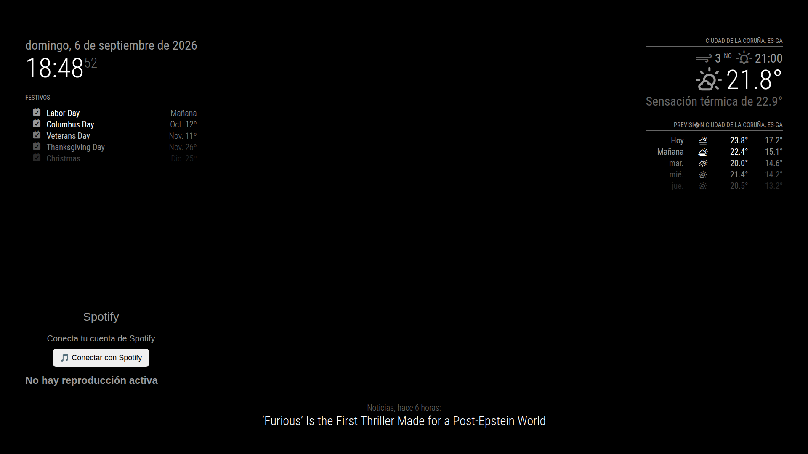
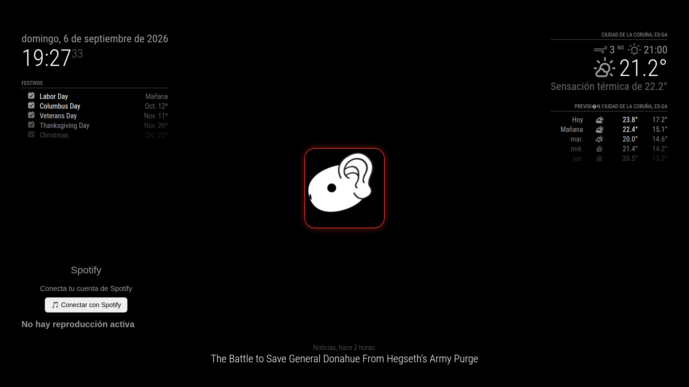
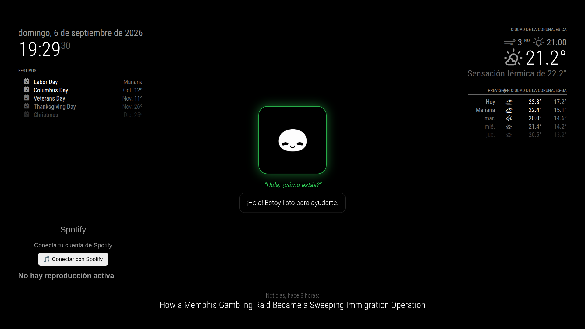
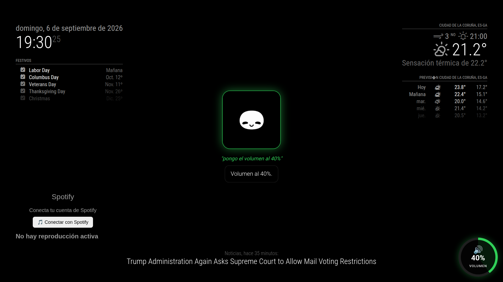
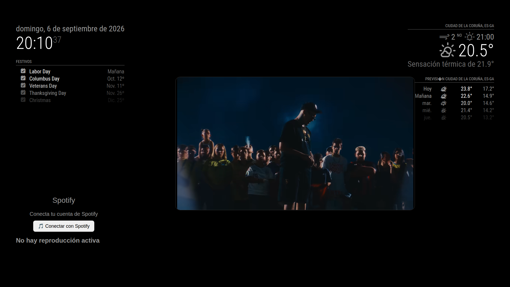

# MMM-TuAsistente

## 🚀 INSTALACIÓN

```bash
cd ~/MagicMirror/modules
git clone https://github.com/orlandoida06-rgb/MMM-TuAsistente.git
cd MMM-TuAsistente
chmod +x install.sh
./install.sh
```

El instalador es modular. Permite seleccionar exactamente los componentes que quieres instalar.

### Componentes

- MMM-TuAsistente
- MMM-TuAsistente-Spotify
- LibreSpot
- Ollama
- Piper TTS
- Wake Word / PTT
- Audio
- Configuración automática de MagicMirror

### Spotify independiente

Selecciona `MMM-TuAsistente-Spotify`. LibreSpot se selecciona automáticamente como dependencia.

```text
✓ MMM-TuAsistente-Spotify
✓ LibreSpot
```

No se instalan automáticamente TuAsistente, Ollama, Piper, Wake Word/PTT ni Audio.

### Asistente completo

Selecciona `MMM-TuAsistente`, `Ollama`, `Piper TTS`, `Wake Word / PTT` y `Audio`. Las dependencias se resuelven automáticamente.

### Configuración automática

Puedes seleccionar la configuración automática de MagicMirror. Se realiza copia de seguridad de `config.js` y comprobación de sintaxis.

### Reiniciar

```bash
pm2 restart mm
```

---

# MMM-TuAsistente

**MMM-TuAsistente** es un módulo inteligente y local para **MagicMirror²** impulsado por modelos LLM locales (**Ollama / Qwen**), síntesis de voz offline (**Piper TTS**) y detección de voz/PTT (**OpenWakeWord** / Tecla física). Diseñado y optimizado para funcionar de manera fluida en placas SBC como **Orange Pi 5** y **Raspberry Pi**.

---

## 🧩 Características

* 🤖 **LLM 100% Local:** Integración directa con Ollama (por defecto `qwen2.5:1.5b` o `gemma3:4b`).
* 🔊 **Síntesis de Voz Offline:** Voz natural y rápida usando **Piper TTS** (`es_ES-davefx-medium`).
* 🎙️ **Doble Modo de Activación:**
  * **Wake Word (Voz):** Escucha continua usando **OpenWakeWord** (*"Hey Mycroft"*).
  * **PTT (Push-To-Talk):** Activación por teclado o botón físico mediante script dedicado.
* ▶️ **Control de YouTube:** Reproduce y cierra vídeos mediante comandos de voz directos (vía `yt-dlp`).
* ⚡ **Optimizado para ARM64:** Uso eficiente de recursos sin depender de APIs en la nube.

---

## 🛠️ Requisitos Previos

1. **MagicMirror²** instalado y en funcionamiento.
2. **Ollama** instalado y corriendo en la máquina local (`http://localhost:11434`).
   ```bash
   ollama pull qwen2.5:1.5b
---

# 🖼️ Capturas del módulo

## 🏠 Interfaz principal

<p align="center">

</p>

## 🎙️ Escuchando

<p align="center">

</p>

## 🧠 Pensando

<p align="center">

</p>

## 🔊 Volumen

<p align="center">

</p>

## ▶️ YouTube

<p align="center">

</p>

## 🎛️ Control de módulos por voz

MMM-TuAsistente permite controlar la visibilidad de otros módulos de MagicMirror mediante comandos de voz.

El asistente permanece visible mientras controla el resto de módulos.

### Comandos disponibles

#### Ocultar y mostrar todos los módulos

- **"Oculta todo"**
- **"Muestra todo"**

#### Control del tiempo

- **"Oculta el tiempo"**
- **"Muestra el tiempo"**
- También se reconocen referencias como "clima" o "weather".

#### Control de Spotify

- **"Oculta Spotify"**
- **"Muestra Spotify"**
- También se reconocen comandos relacionados con "música".

#### Control de noticias

- **"Oculta las noticias"**
- **"Muestra las noticias"**
- También se reconoce "noticia".

### Funcionamiento

El control de visibilidad está integrado directamente en `MMM-TuAsistente`, sin necesidad de instalar un módulo adicional.

Cuando se reconoce un comando:

1. El asistente identifica la acción (`ocultar` o `mostrar`).
2. Identifica el grupo de módulos afectado.
3. Envía la orden al frontend de MagicMirror.
4. Los módulos realizan una transición animada.
5. El asistente confirma la acción mediante voz.

Los grupos actualmente disponibles son:

- `all` — todos los módulos controlables.
- `weather` — módulos meteorológicos.
- `spotify` — MMM-TuAsistente-Spotify.
- `news` — módulo de noticias.

`MMM-TuAsistente` no se oculta mediante el comando "Oculta todo", por lo que siempre permanece disponible para recibir nuevos comandos de voz.

### Perfiles de pantalla

La arquitectura de control de visibilidad permite ampliar el sistema posteriormente con perfiles completos de pantalla, por ejemplo:

- **Modo limpio** — interfaz mínima.
- **Modo información** — reloj, tiempo, calendario y noticias.
- **Modo música** — interfaz centrada en Spotify.
- **Modo noche** — pantalla prácticamente limpia.

Estos perfiles podrán activarse también mediante comandos de voz.
